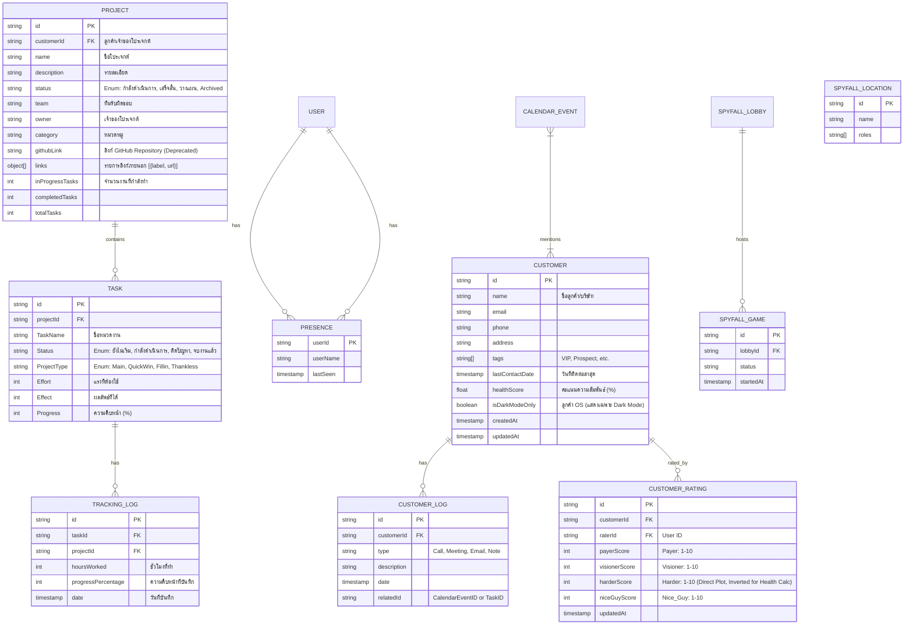

# รายละเอียดฟังก์ชันระบบ (Functional Specification)

## คุณสมบัติระบบ (System Features)

### ระบบหลัก (Core System)
- **[F-001] การยืนยันตัวตน (User Authentication)**
  - เข้าสู่ระบบ/สมัครสมาชิกผ่าน Firebase Auth
  - การจัดการโปรไฟล์ผู้ใช้
- **[F-013] ระบบเอกสารสัญญา (Legal Agreements)**
  - รองรับการแสดงผลและยอมรับสัญญาหลายฉบับในหน้าเดียว
  - **Reusable Component**: ใช้ `LegalAgreement` ([C-010]) ที่รองรับ Scrollable content และ Checkbox
  - **Default Agreements**:
    - Transport Service Agreement
    - Guarantor Agreement
  - **Validation**: ต้องยอมรับครบทุกสัญญาถึงจะกด Submit ได้

### การบริหารจัดการโปรเจกต์ (Project Management)
- **[F-002] แดชบอร์ดโปรเจกต์ (Project Dashboard)**
    - **Description**: ศูนย์กลางการบริหารจัดการโปรเจกต์ แสดงภาพรวมสถานะงาน และจัดการข้อมูลโปรเจกต์ (CRUD) พร้อมเชื่อมโยง Owner กับ Customer DB
    - **User Flow**:
        1. **View List**: User เข้าหน้า `/projects` -> ระบบแสดงโปรเจกต์แยกตามสถานะ (Running, Finished, etc.)
        2. **Create Project**: User กด "New Project" -> กรอกฟอร์ม + เลือก Owner (Autocomplete) -> Submit -> ระบบสร้าง Record และ Update UI
        3. **Quick Add Customer**: หาก Owner ไม่มีในระบบ กด "Quick Add Customer" -> กรอกชื่อ -> ระบบสร้าง Customer ใหม่และ Auto-select ให้ทันที
        4. **GitHub Link Interaction**: บนการ์ดโปรเจกต์ แสดงไอคอน Clip Label ที่มุมซ้ายล่าง เมื่อคลิกจะแสดงรายการ Links ทั้งหมด (รองรับ Label + URL) ให้เลือกกด
        5. **In-Progress Indicator**: บนการ์ดโปรเจกต์ แสดงไอคอน Hammer พร้อมตัวเลขจำนวนงานที่กำลังทำ (ไม่มี Popover/Tooltip)
        6. **In-Progress Filter**: เพิ่มตัวเลือกกรองใน Dropdown "Group by" / "Sort by" สำหรับแสดงเฉพาะโปรเจกต์ที่มีงาน In-Progress
        7. **Completion Indicator**: บนการ์ดโปรเจกต์ ใช้ไอคอน CheckCircle แทนข้อความ "Complete" เพื่อความกะทัดรัด (Format: `[Icon] X/Y`)
        8. **Real-time Stats**: เมื่อมีการเปลี่ยนแปลงสถานะ Task ให้ทำการ Trigger Update ข้อมูลสถิติของ Project และ Refresh หน้า Projects List ทันที
    - **Key Components**:
        - `src/app/projects/page.tsx` (Edge Runtime Container)
        - `src/app/projects/projects-client-page.tsx` (State & UI Logic)
        - `src/components/new-project-dialog.tsx` (Form)
        - `src/components/project-card.tsx` (Display Item)
        - `src/components/ui/single-select-autocomplete.tsx` (Owner Selector)
    - **Data Usage**:
        - `Project`: `id`, `name`, `status`, `owner`, `customerId`, `category`
        - `Customer`: `id`, `name` (Source for Owner)

- **[F-003] การจัดการงานแบบ Kanban (Task Management)**
    - **Description**: ระบบจัดการงานย่อยภายในโปรเจกต์ในรูปแบบ Kanban Board รองรับ Drag & Drop, Real-time Presence, และการจัดหมวดหมู่แบบ Matrix
    - **User Flow**:
        1. **View Board**: User เข้าหน้า `/project/[id]` -> ระบบแสดง Tasks แยกตาม Column (Status)
        2. **Drag & Drop**: User ลากการ์ดข้าม Column -> ระบบ Update Status (`Progress`) ทันที (Optimistic UI)
        3. **Edit Task**: User คลิกที่การ์ด -> เปิด Dialog แก้ไข (Effort, Effect, Assignee) -> Save
        4. **Real-time Awareness**: เห็น Avatar เพื่อนโผล่ขึ้นมาเมื่อมีการแก้ไขการ์ดเดียวกัน
    - **Key Components**:
        - `src/app/project/[id]/page.tsx` (Data Fetcher)
        - `src/components/project-details-client.tsx` (Board Logic, DND Context)
        - `src/components/task-card.tsx` (Draggable Item)
        - `src/components/new-task-dialog.tsx` & `edit-task-dialog.tsx`
    - **Data Usage**:
        - `Task`: `projectId`, `status`, `effort`, `effect`, `progress`
        - `Presence`: `userId`, `taskId` (Real-time tracking)
    - **[F-014] กลุ่มผู้รับผิดชอบ (Assignee Groups)**
    - **Description**: ระบบจัดการกลุ่มผู้ใช้งานเพื่อความสะดวกในการมอบหมายงาน
    - **Features**:
        - **Create Group**: สร้างกลุ่มใหม่จากชื่อและสมาชิก
        - **Assign Group**: เลือกกลุ่มในช่อง Assignee -> ระบบจะแตกสมาชิกรายคนให้อัตโนมัติ (แต่เก็บชื่อกลุ่มไว้แสดงผล)
        - **Edit Group**: แก้ไขชื่อกลุ่มและสมาชิกในกลุ่มได้ (Changes reflect on new assignments)

### เครื่องมือเพิ่มประสิทธิภาพ (Productivity Tools)
- **[F-004] การติดตามเวลาและความคืบหน้า (Time & Progress Tracking)**
  - บันทึกชั่วโมงทำงานและ % ความคืบหน้ารายวัน (`ProjectTrackingProgress`)
  - **On-Demand Loading**: ดึงข้อมูลประวัติการทำงานเฉพาะ **Task ที่เกี่ยวข้องกับผู้ใช้ที่เลือก** และ **ตามความจำเป็น** (Chunk Query) เพื่อความรวดเร็ว
  - **OS Project Filtering**:
      - **Dark Mode**: แสดงเฉพาะ Tasks ของ OS Project
      - **Light Mode**: แสดงเฉพาะ Tasks ของ Standard Project
  - **Logic**:
    - **Dual Update**: เมื่อบันทึก ระบบจะ save ลง 2 ที่พร้อมกัน:
      1. `projectTrackingProgress` (History Log): เก็บประวัติว่าวันนี้นาย A ทำงาน B ไปกี่ ชม.
      2. `tasks` (Master Data): อัปเดต `% Progress` ล่าสุดของงานนั้นทันที เพื่อให้ Project Manager เห็นสถานะจริง
    - **Gallery Upload**: สามารถอัปโหลดรูปภาพได้โดยตรงจากหน้า **Project Gallery** (ไม่ต้องผูกกับ Task) โดยระบบจะบันทึกเป็น "General Project Attachment".
    - **Image Optimization**: ระบบจะทำการ Resize รูปภาพฝั่ง Client ก่อนอัปโหลดเพื่อประหยัดพื้นที่จัดเก็บและลดระยะเวลาอัปโหลด.
- **[F-015] การแนบรูปภาพและแกลเลอรีโปรเจกต์ (Task Image Upload & Project Gallery)**
  - **Description**: ระบบแนบรูปภาพความคืบหน้างานรายวัน และแสดงผลในรูปแบบแกลเลอรีรวมของโปรเจกต์
  - **Features**:
    - **Task Attachment**: แนบรูปได้หลายรูปในแต่ละวันของการ Tracking (เก็บลง R2 Storage)
    - **Project Gallery**: ดูรูปภาพทั้งหมดของโปรเจกต์ผ่านปุ่ม "Files" บนการ์ดโปรเจกต์
  - **Data Usage**:
    - `ProjectTrackingProgress.attachments`: เก็บ URL ของรูปภาพ (`string[]`)
  - **Key Components**:
    - `src/app/tracking/tracking-client.tsx` (Upload UI)
    - `src/components/project-files-gallery.tsx` (Gallery View)
- **[F-006] ปฏิทินและตารางงาน (Calendar & Scheduling)**
  - แสดงงานและเหตุการณ์ในรูปแบบปฏิทิน (Month/Week/Day)
  - **Live Presence**: เห็นว่าใครกำลังเปิดดูหรือแก้ไข Event ไหนอยู่ในหน้าปฏิทิน
  - เชื่อมโยง Event กับ Task และ Project ได้ (Traceability)
  - **Members Autocomplete**:
    - กรองลูกค้า OS (`isDarkModeOnly`) ตาม Dark Mode (Additive Logic: Dark Mode เห็นครบ, Light Mode ไม่เห็น OS)
  - **Event Filtering**:
    - **Events (Project/Task)**: ใช้ Mutually Exclusive Logic (Dark=OS Only, Light=Standard Only)
  - **New Features**:
    - **Duplicate Event**: คัดลอก Event เดิมเพื่อสร้างใหม่ (Reset Data/Time)
    - **Recurring Events**: รองรับการสร้าง Event แบบ Daily, Weekly, Monthly, Yearly (Client-side expansion)
    - **Refinement**: Recurrence End Date แยกอิสระจาก Event End Date (Decoupled)
    - **Mutations (Edit/Delete)**:
      - **Series**: Edit/Delete Master Doc (Result: Changes all future instances).
      - **UI Flow**:
        - กด "Save" -> ระบบถาม (Prompt): "Save This Only" หรือ "Save Series".
      - **Instance**:
        - **Delete**: Add date to `recurrence.exceptions[]`.
        - **Edit**: Create Exception on Master + Create New Single Event on that date.


      - **Events (Project/Task)**: ใช้ Mutually Exclusive Logic (Dark=OS Only, Light=Standard Only)
- **[F-010] ระบบวิเคราะห์ข้อมูล (Analytics Dashboard)** (`src/app/analytics`)
  - **Purpose**: วิเคราะห์ภาพรวมการทำงานของทีมผ่าน 2 มุมมองหลัก (Tabs)
  - **Structure (Tabbed Interface)**:
    1. **Task Overview (มุมมองการจัดการ)**:
       - **Focus**: สถานะงาน (Status), การกระจายงาน (Assignee), ความสำคัญ (Priority Matrix)
       - **Visuals**: Donut Chart, Bar Chart, Scatter Plot, Burndown Chart
    2. **Workload Analysis (มุมมองประสิทธิภาพ)**:
       - **Focus**: ชั่วโมงการทำงานจริง (Actual Hours), ประสิทธิภาพทีม
       - **Visuals**:
         - **Project Ranking**: จัดอันดับโปรเจกต์ที่ใช้เวลาเยอะที่สุด
         - **Employee Ranking**: ใครทำงานหนักที่สุด (Top Performers)
         - **Trend**: แนวโน้มการทำงานรายสัปดาห์/เดือน
         - **Performance Table**: ตารางรายละเอียดงานพร้อม Hours Worked สะสม
  - **Interactivity**:
    - **Global Filtering**: ระบบกรองข้อมูลกลาง (Header) ส่งผลต่อกราฟในทุก Tabs
      - **Slicers**: Project, Status, Assignee, Date Range.
      - **Metric Cards**: Showing Filtered Projects Count, Employee Total, and Filtered Hours.
    - **State Persistence**:
      - **Behavior**: Remembers Filter/Selection state across navigation sessions using `localStorage`.
      - **Scope**: Analytics Filters, Tracking Slicers.
    - **Deep Dive**: คลิกที่กราฟเพื่อ Drill-down ข้อมูลเฉพาะส่วนนั้นๆ
    - **Sorting**: Tables must support column-based sorting (Ascending/Descending) by clicking on headers.
    - **Column Structure**: Separate 'Progress' and 'Due Date' columns for better readability (No combined 'Details' column).
    - **Scrollable**: Fixed height with internal scrolling.

### ระบบเสริม (Auxiliary Systems)
- **[F-011] การจำค่าสถานะ (UI State Persistence)**
  - **Concept**: Short-term Memory สำหรับ User Experience
  - **Mechanism**: ใช้ `localStorage` เก็บค่า Filter/Selection
  - **Scope**:
    - **Analytics**: Project, Date, Assignee, Status, Priority filters
    - **Tracking**: Tracking Person, Project, Date selections

- **[F-012] การนำขึ้นระบบ (Deployment)**
  - **Platform**: Cloudflare Pages
  - **Runtime**: Edge (via `@cloudflare/next-on-pages`)
  - **Cost Strategy**: Zero Cost (leverage Free Tier for Pages & Workers)
  - **CI/CD**: Automatic deployment via Cloudflare-GitHub Integration.

### 5. Future Scalability

### ระบบ AI (AI Integration)
- **[F-007] ผู้ช่วย AI (Genkit)**
  - ใช้ **Google Genkit** ในการช่วยเหลือด้านการพัฒนา (Development Flows)

### การบริหารความสัมพันธ์ลูกค้า (CRM)
- **[F-008] ระบบจัดการข้อมูลลูกค้า (Customer Relationship Management)** (`src/app/customers/*`)
  - จัดเก็บข้อมูลลูกค้า: ชื่อ, ช่องทางติดต่อ, อีเมล, เบอร์โทร
  - **Health Score & Rating**:
    - ให้คะแนนลูกค้าตาม 4 มิติ (1-10 คะแนน)
    - แสดงผลด้วย Radar Chart และคำนวณ % Health
  - **Project Linkage**: เชื่อมโยง Customers เข้ากับ Projects
  - **Performance Mode**:
    - หน้า **Customer List**: ปิดการคำนวณ Project Stats (Total/Completed) แบบ Real-time เพื่อความรวดเร็วในการโหลด (Stats ดูได้ในหน้า Detail)
  - **OS Customer Filtering**:
    - รองรับการแบ่งแยก "ลูกค้า OS" ออกจากลูกค้าปกติ
    - ทำงานร่วมกับ **Dark Mode**:
      - **Customer List/Select**: Dark Mode เห็นครบ, Light Mode เห็นเฉพาะลูกค้าทั่วไป

### การเสถียรภาพและประสิทธิภาพ (Stability & Performance)
- **[F-009] การปรับปรุงประสิทธิภาพและลดค่าใช้จ่าย (Performance & Cost Optimization)**
  - **Global Listener Removal**: ยกเลิกการดึงข้อมูลทั้ง Collection (`onSnapshot`) ในจุดที่ไม่จำเป็น (Customers Page)
  - **Global Caching Strategy**: ใช้ `DataCacheContext` เก็บข้อมูล Customers (Global State) + **Auto-Refresh ทุก 1 นาที** เพื่อให้ข้อมูล Real-time พอประมาณโดยไม่โหลดซ้ำ (Sustain & Lean)
  - **Targeted Fetching**: ในหน้า Tracking, ดึง Log เฉพาะของผู้ใช้ที่เลือก (`trackerName`) แทนการดึงตาม Task ID (Chunk List) เพื่อแก้ปัญหา Permission และคำนวณ Total Hours ได้แม่นยำ
  - **Pagination & Indexing**: ใช้ Indexing และ Limit ในการดึงข้อมูล Lists ใหญ่ๆ
  - **Lazy Loading**: โหลด Component กราฟหนักๆ เฉพาะเมื่อต้องแสดงผล
  - **Sustainable Security Rules**: ใช้ `firestore.rules` แบบเปิดกว้าง (User-based Check) แทนการ Filter ที่ซับซ้อน เพื่อความยั่งยืนของการ Query

---

## แบบจำลองข้อมูล (Data Models)

อ้างอิงจาก `src/lib/types.ts`



## ขั้นตอนการใช้งาน (User Flows)

### 1. การตั้งค่าโปรเจกต์และงาน (Project & Task Setup)
1. ผู้ใช้เข้าสู่ระบบ (Auth)
2. ผู้ใช้สร้าง **Project** ใหม่ (เช่น "Website Redesign")
3. ผู้ใช้เพิ่ม **Tasks** เข้าไปในโปรเจกต์ พร้อมระบุ **Type** (เช่น "QuickWin")
4. งานจะปรากฏบน Dashboard และปฏิทินทันที

### 2. การติดตามงานรายวัน (Daily Work Tracking)
1. ผู้ใช้เลือกงานที่ต้องการอัปเดต (Task)
2. ผู้ใช้บันทึก "ชั่วโมงที่ทำ (Hours Worked)" และ "ความคืบหน้าล่าสุด (Progress %)"
3. ระบบสร้างบันทึก `ProjectTrackingProgress`
4. Progress Bar ของโปรเจกต์อัปเดตอัตโนมัติ

---

## สถาปัตยกรรมระบบ (Architecture)

```mermaid
graph TD
    User[User Browser / ผู้ใช้งาน]
    
    subgraph Frontend [Next.js App Router]
        Page[Pages (src/app)]
        Comp[Components (Shadcn UI)]
        Lib[Lib (src/lib)]
    end
    
    subgraph Backend [Firebase Services]
        Auth[Firebase Auth]
        Store[Firestore DB]
        Host[App Hosting]
    end
    
    subgraph AI [AI Layer]
        Genkit[Google Genkit Node]
    end

    User --> Page
    Page --> Comp
    Comp --> Lib
    Lib --> Auth
    Lib --> Store
    Lib --> Genkit
```

## แผนผังโครงสร้างระบบ (System Structure Tree / Sitemap)

```mermaid
graph TD
    Root[/]
    Root --> Login[Login / เข้าสู่ระบบ]
    Root --> Dashboard[Dashboard /projects]
    
    Dashboard --> CreateProj[Create Project / สร้างโปรเจกต์]
    Dashboard --> ViewProj[Project Details /project/:id]
    
    ViewProj --> TaskList[Task List / รายการงาน]
    ViewProj --> Kanban[Kanban Board / กระดานงาน]
    ViewProj --> Timeline[Timeline / ไทม์ไลน์]
    
    Root --> Calendar[Calendar /calendar]
    Root --> Analytics[Analytics /analytics]
    Root --> Party[Party Team /party]
    Root --> Customers[Customers /customers]
    Party --> SpyFall[Game: Spyfall]
    Customers --> CustomerDetail[Detail /customers/:id]
```

    }

## 6. Performance & Cost Constraints (Non-Functional)
- **Data Freshness**: Customer cache auto-refresh interval = **5 minutes** (from 1 min) to optimize costs.
- **Idle System (Soft-Logout)**:
  - เมื่อไม่มี Interaction เกิน **4 นาที 30 วินาที** -> แสดง **Overlay (Backdrop Blur)** + ปุ่ม "Re-connect"
  - **Stop Polling**: ระบบจะหยุดดึงข้อมูล Background Cache ชั่วคราวเมื่อ Overlay แสดง (Load Shedding)
  - **Resume**: เมื่อผู้ใช้กด Re-connect จะดึงข้อมูลล่าสุดทันทีและเริ่มนับเวลาใหม่
