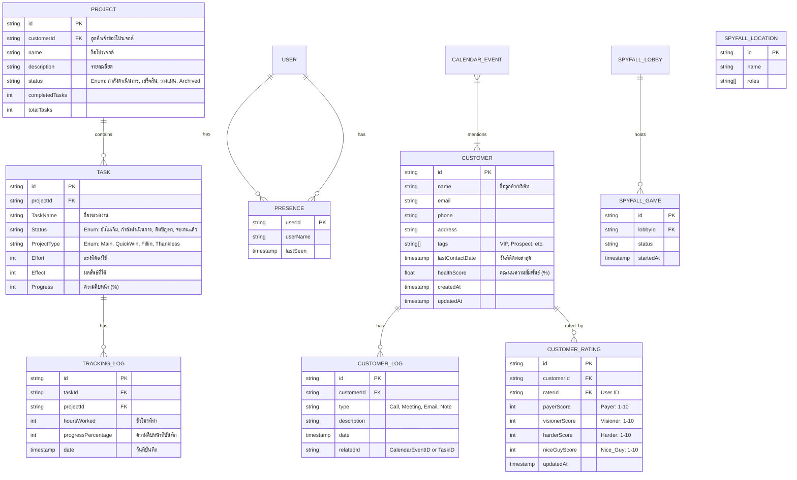

# รายละเอียดฟังก์ชันระบบ (Functional Specification)

## คุณสมบัติระบบ (System Features)

### ระบบหลัก (Core System)
- **[F-001] การยืนยันตัวตน (User Authentication)**
  - เข้าสู่ระบบ/สมัครสมาชิกผ่าน Firebase Auth
  - การจัดการโปรไฟล์ผู้ใช้

### การบริหารจัดการโปรเจกต์ (Project Management)
- **[F-002] แดชบอร์ดโปรเจกต์ (Project Dashboard)**
  - แสดงรายการโปรเจกต์ทั้งหมดพร้อมสถานะ:
    - `กำลังดำเนินการ` (Running)
    - `เสร็จสิ้น` (Finished)
    - `วางแผน` (Planned)
    - `Archived`
  - สรุปตัวเลข: งานที่เสร็จ vs งานทั้งหมด
  - สร้าง/แก้ไข/ลบ โปรเจกต์ (CRUD)
- **[F-003] การจัดการงาน (Task Management)**
  - ติดตามงานอย่างละเอียดภายในโปรเจกต์
  - **การจัดหมวดหมู่ (Matrix)**:
    - `Main` (งานหลัก)
    - `QuickWin` (งานด่วนได้ผลเร็ว)
    - `Fillin` (งานแทรก)
    - `Thankless` (งานปิดทองหลังพระ)
  - ติดตามสถานะ: `ยังไม่เริ่ม`, `กำลังดำเนินการ`, `ติดปัญหา`, `จบงานแล้ว`
  - ข้อมูลระบุ: Effort (แรงที่ใช้), Effect (ผลลัพธ์), วันเริ่ม/จบ, ผู้รับผิดชอบ
  - **การแสดงผล (Visualization)**: ใช้ Modular Chart Components (`src/components/charts/*`) แยกตามประเภทกราฟ (Pie, Bar, Scatter) เพื่อลดขนาดไฟล์และเพิ่มความเร็วในการโหลด

### เครื่องมือเพิ่มประสิทธิภาพ (Productivity Tools)
- **[F-004] การติดตามเวลาและความคืบหน้า (Time & Progress Tracking)**
  - บันทึกชั่วโมงทำงานและ % ความคืบหน้ารายวัน (`ProjectTrackingProgress`)
  - ดูประวัติการแก้ไขเพื่อความโปร่งใส (Accountability)
- **[F-005] มุมมองปฏิทิน (Calendar View)**
  - ไทม์ไลน์แสดงงานและเหตุการณ์ในรูปแบบปฏิทิน
  - แยกสีตามประเภทของโปรเจกต์หรืองาน
- **[F-006] การทำงานร่วมกันแบบเรียลไทม์ (Party Mode)**
  - ระบบ "Presence" แสดงผู้ที่กำลังออนไลน์หรือแก้ไขงานอยู่
  - แสดง Avatar ของผู้ใช้งาน
  - **Mini Game**: มีเกม "Spyfall" สำหรับเล่นกระชับมิตรในทีม (`src/app/party/spyfall`)

### ระบบ AI (AI Integration)
- **[F-007] ผู้ช่วย AI (Genkit)**
  - ใช้ **Google Genkit** ในการช่วยเหลือด้านการพัฒนา (Development Flows)
  - รองรับการสร้าง Flow สำหรับ AI Agent ใน `src/ai/dev.ts`

### การบริหารความสัมพันธ์ลูกค้า (CRM)
- **[F-008] ระบบจัดการข้อมูลลูกค้า (Customer Relationship Management)** (`src/app/customers/*`)
  - จัดเก็บข้อมูลลูกค้า: ชื่อ, ช่องทางติดต่อ, อีเมล, เบอร์โทร
  - **Health Score & Rating**:
    - ให้คะแนนลูกค้าตาม 4 มิติ (1-10 คะแนน):
      1. **Payer** (การจ่ายเงิน)
      2. **Visioner** (วิสัยทัศน์และการเติบโต)
      3. **Nice Guy** (ความง่ายในการสื่อสาร)
      4. **Harder** (ความยากในการทำงาน - ยิ่งมากยิ่งคะแนนน้อย)
    - **สูตรคำนวณ Health (%)**: `((Payer + Visioner + Nice Guy + (10 - Harder)) / 40) * 100` ใช้ Radar Chart ในการแสดงผล
  - **Project Linkage**: เชื่อมโยง Customers เข้ากับ Projects เพื่อดู 360-View (เห็นทุกโปรเจกต์ของลูกค้าคนนี้ในหน้าเดียว)
  - **Activity Log**: บันทึกประวัติการติดต่อและกิจกรรมที่เกิดขึ้น

### การเสถียรภาพและประสิทธิภาพ (Stability & Performance)
- **[F-009] การปรับปรุงประสิทธิภาพและลดค่าใช้จ่าย (Performance & Cost Optimization)**
  - **Pagination**: ใช้การดึงข้อมูลแบบแบ่งหน้า (Pagination) หรือ Infinite Scroll สำหรับรายการที่มีข้อมูลมาก (Customers, Projects) เพื่อลดจำนวน Read Operations
  - **Server-Side Filtering**: ย้าย Logic การค้นหาและกรองข้อมูลไปทำที่ระดับ Query เพื่อลดปริมาณข้อมูลที่ส่งมายัง Client
  - **Query Limits**: จำกัดจำนวนข้อมูลที่ดึงมาแสดงผลในแต่ละครั้ง และใช้ Indexing เพื่อความรวดเร็ว
  - **On-Demand Fetching**: เปลี่ยนจาก Real-time Listener (`onSnapshot`) เป็นการดึงข้อมูลเมื่อจำเป็น (`getDocs`) ในส่วนข้อมูลที่ไม่ได้เปลี่ยนแปลงบ่อย (Cost Saving)

---

## แบบจำลองข้อมูล (Data Models)

อ้างอิงจาก `src/lib/types.ts`



## ขั้นตอนการใช้งาน (User Flows)

### 1. การตั้งค่าโปรเจกต์และงาน (Project & Task Setup)
1. ผู้ใช้เข้าสู่ระบบ (Auth)
2. ผู้ใช้สร้าง **Project** ใหม่ (เช่น "Website Redesign")
3. ผู้ใช้เพิ่ม **Tasks** เข้าไปในโปรเจกต์ พร้อมระบุ **Type** (เช่น "QuickWin")
4. งานจะปรากฏบน Dashboard และปฏิทินทันที

### 2. การติดตามงานรายวัน (Daily Work Tracking)
1. ผู้ใช้เลือกงานที่ต้องการอัปเดต (Task)
2. ผู้ใช้บันทึก "ชั่วโมงที่ทำ (Hours Worked)" และ "ความคืบหน้าล่าสุด (Progress %)"
3. ระบบสร้างบันทึก `ProjectTrackingProgress`
4. Progress Bar ของโปรเจกต์อัปเดตอัตโนมัติ

---

## สถาปัตยกรรมระบบ (Architecture)

```mermaid
graph TD
    User[User Browser / ผู้ใช้งาน]
    
    subgraph Frontend [Next.js App Router]
        Page[Pages (src/app)]
        Comp[Components (Shadcn UI)]
        Lib[Lib (src/lib)]
    end
    
    subgraph Backend [Firebase Services]
        Auth[Firebase Auth]
        Store[Firestore DB]
        Host[App Hosting]
    end
    
    subgraph AI [AI Layer]
        Genkit[Google Genkit Node]
    end

    User --> Page
    Page --> Comp
    Comp --> Lib
    Lib --> Auth
    Lib --> Store
    Lib --> Genkit
```

## แผนผังโครงสร้างระบบ (System Structure Tree / Sitemap)

```mermaid
graph TD
    Root[/]
    Root --> Login[Login / เข้าสู่ระบบ]
    Root --> Dashboard[Dashboard /projects]
    
    Dashboard --> CreateProj[Create Project / สร้างโปรเจกต์]
    Dashboard --> ViewProj[Project Details /project/:id]
    
    ViewProj --> TaskList[Task List / รายการงาน]
    ViewProj --> Kanban[Kanban Board / กระดานงาน]
    ViewProj --> Timeline[Timeline / ไทม์ไลน์]
    
    Root --> Calendar[Calendar /calendar]
    Root --> Analytics[Analytics /analytics]
    Root --> Party[Party Team /party]
    Root --> Customers[Customers /customers]
    Party --> SpyFall[Game: Spyfall]
    Customers --> CustomerDetail[Detail /customers/:id]
```
