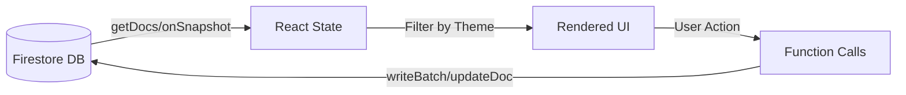

# ตารางตรวจสอบความครบถ้วนของความต้องการ (Requirement Traceability Matrix - RTM)

| รหัสฟีเจอร์ [Feature ID] | ชื่อฟีเจอร์ (Spec Feature Name) | งานที่เกี่ยวข้อง [Tasks] | ไฟล์โค้ดหลัก (Key Code Files) | สถานะ (Status) |
| :--- | :--- | :--- | :--- | :--- |
| **[F-001]** | การยืนยันตัวตน (User Authentication) | [T-003] | `src/lib/firebase.ts`, `Firestore: customers` | **Active** |
| **[F-002]** | การจัดการโปรเจกต์ (Project Management) | [T-010], [T-011], [T-066], [T-015], [T-016], [T-110], [T-113], [T-114], [T-118], [T-119], [T-124], [T-173], [T-174], [T-175], [T-177], [T-178], [T-179], [T-181], [T-182] | `src/app/projects/page.tsx`, `src/lib/types.ts` (Project), `src/components/new-project-dialog.tsx` | **Beta** |
| **[F-003]** | การจัดการงาน (Task Management) | [T-013], [T-014], [T-061], [T-063], [T-115], [T-116], [T-117], [T-121], [T-122], [T-123], [T-126], [T-127], [T-133], [T-134], [T-159] | `src/app/project/[id]/page.tsx` (uses **Lite SDK**), `src/components/project-details-client.tsx`, `src/components/edit-task-dialog.tsx`, `src/lib/anonymous-animals.ts`, `src/components/charts/*`, `src/components/strict-mode-droppable.tsx` | **Beta** |
| **[F-004]** | การติดตามเวลา (Time Tracking) | [T-031], [T-064], [T-065], [T-029], [T-085] | `src/lib/types.ts`, `src/app/tracking/tracking-client.tsx` | **Beta** |
| **[F-005]** | มุมมองปฏิทิน (Calendar View) | [T-020], [T-021], [T-064], [T-066], [T-029], [T-125], [T-154], [T-155], [T-156], [T-157], [T-158], [T-162], [T-163], [T-165], [T-166], [T-167], [T-168], [T-169], [T-170] | `src/app/calendar/page.tsx`, `src/app/calendar/calendar-client-page.tsx`, `src/app/calendar/data-fetcher.ts` (uses **Lite SDK**), `src/app/calendar/new-event-dialog.tsx` (uses **Client SDK**) | **Active** |
| **[F-006]** | โหมดปาร์ตี้ (Party Mode: Presence & Spyfall)| [T-030] | `src/app/party/*`, `Firestore: spyfall_*` | **Planned** |
| **[F-007]** | ผู้ช่วย AI (AI Assistant) | [T-040], [T-165], [T-166] | `src/ai/dev.ts`, `Spec_Kit/AI_Tool_Trip.md` | **Active** |
| **[F-008]** | ระบบบริหารความสัมพันธ์ลูกค้า (CRM) & 360 View | [T-025], [T-026], [T-027], [T-029], [T-066], [T-016], [T-070] | `src/app/customers/*` (`src/app/customers/[id]/page.tsx` uses **Lite SDK**), `src/components/add-customer-dialog.tsx`, `src/lib/types.ts` (Customer, Rating) | **Active** |
| **[F-009]** | การปรับปรุงประสิทธิภาพและลดค่าใช้จ่าย (Performance Optimization) | [T-070], [T-071], [T-072], [T-073], [T-074], [T-084], [T-104], [T-105], [T-106], [T-107], [T-108], [T-171] | `src/app/customers/customer-list-client.tsx`, `src/app/tracking/tracking-client.tsx`, `src/lib/firebase.ts`, `src/lib/firebase-lite.ts`, `src/components/session-timeout.tsx`, `src/app/loading.tsx` | **Active** |
| **[F-010]** | ระบบวิเคราะห์ข้อมูล (Analytics Dashboard) | [T-022], [T-101], [T-102], [T-103] | `src/app/analytics/*` (uses **Lite SDK**), `src/components/charts/filtered-tasks-table.tsx` | **Active** (Features: Sorting, Global Filters (Project/Status/Assignee/Date), Metric Cards, Personalized Columns, Split Columns) |
| **[F-011]** | การจำค่าสถานะ (UI State Persistence) | [T-119], [T-172] | `src/hooks/use-local-storage.ts` | **Active** |
| **[F-012]** | การนำขึ้นระบบ (Deployment) | [T-120], [T-176], [T-180] | `deploy_prod.sh`, `package.json` | **Active** |
| **[F-013]** | ระบบเอกสารสัญญา (Legal Agreements) | [T-128], [T-129], [T-130] | `src/components/legal-agreement.tsx`, `src/components/application-form.tsx` | **Beta** |
| **[F-014]** | กลุ่มผู้รับผิดชอบ (Assignee Groups) | [T-141], [T-153], [T-155], [T-167] | `src/lib/types.ts` (AssigneeGroup), `src/components/create-group-dialog.tsx`, `src/components/ui/multi-select-autocomplete.tsx`, `src/components/ui/member-selector-with-group.tsx` | **Active** (Features: Create Group, Group Selection, Member Expansion, Group Badge Display, Edit Group) |
| **[F-015]** | การแนบรูปภาพและแกลเลอรีโปรเจกต์ (Task Image Upload & Project Gallery) | [T-120] | `src/app/tracking/tracking-client.tsx`, `src/components/project-files-gallery.tsx`, `src/lib/types.ts` (ProjectTrackingProgress), `src/app/api/upload/route.ts` | **Active** |

## โครงข่ายตัวแปรและแหล่งข้อมูล (Data/Variable Traceability)

ส่วนนี้อธิบายความสัมพันธ์ระหว่าง "ข้อมูลหลัก" (Data Entities) และ "ตัวแปรในโค้ด" (Code Variables) เพื่อให้ง่ายต่อการติดตามและแก้ไขในอนาคต

| ข้อมูลหลัก (Entity) | ชื่อ Interface/Type | ตัวแปร State หลัก (Key State Variables) | ไฟล์ที่เกี่ยวข้อง (Related Files) | หมายเหตุ (Notes) |
| :--- | :--- | :--- | :--- | :--- |
| **Project** | `Project` | `allProjects` (Global List), `selectedProject` (Detail/Edit), `projectsCache` (Global Map) | `src/app/projects/projects-client-page.tsx`, `src/app/tracking/tracking-client.tsx`, `src/lib/types.ts`, `src/app/projects/actions.ts` | Field สำคัญ: `isDarkModeOnly` (OS Filtering), **`customerId`** (Link), **`owner`** (Display Name) |
| **Task** | `Task` | `tasks` (List in Project), `allTasksCache` (Global List in Tracking), `tasksWithProjectName` | `src/app/project/[id]/page.tsx`, `src/app/tracking/tracking-client.tsx`, `src/lib/types.ts` | เชื่อมโยงกับ Project ผ่าน `projectId` (**Tracking Update -> Direct Progress Update**) |
| **Customer** | `Customer` | `customers` (List), `customer` (Detail), `osCustomers` (OS Set for Filtering) | `src/app/customers/customer-list-client.tsx`, `src/app/customers/[id]/customer-detail-client.tsx` (Detail & Edit Form), `src/lib/types.ts` | Field สำคัญ: `isDarkModeOnly`, `healthScore`, **`totalProjects`**, **`completedProjects`**, `ratings`, **Social Media** (Line, FB, WhatsApp) |
| **CalendarEvent** | `CalendarEvent` | `events` (List), `expandedEvents` (Virtual List) | `src/app/calendar/calendar-client-page.tsx`, `src/lib/types.ts` | Added `recurrence` (Client-side expansion) |
| **Legal Agreement** | `ApplicationForm` ([C-011]), `LegalAgreement` ([C-010]) | `isTransportAccepted`, `isGuarantorAccepted`, `isChecked` | `src/components/application-form.tsx`, `src/components/legal-agreement.tsx` | ใช้ Reuse Component `LegalAgreement` สำหรับแสดงและยอมรับเงื่อนไข |
| **Assignee Group** | `AssigneeGroup` | `assigneeGroups` (List) | `src/components/project-details-client.tsx`, `src/components/create-group-dialog.tsx` | กลุ่มผู้ใช้สำหรับมอบหมายงานหลายคนพร้อมกัน (บันทึกเป็นรายบุคคล แต่แสดงผลเป็นกลุ่ม) |
| **Drag & Drop** | `DropIndicator`, `Box Model Collision` | `dragDestination` (State), `mousePosRef` (XY), `customDragIndexRef` (Override Index) | `src/components/project-details-client.tsx` | ใช้ **Midpoint Calculation** & **Global Mouse Tracking** แทน RBD Default เพื่อแก้ปัญหา Guide Line กระโดด ([T-134]) โดยอิง `data-task-index` และ `data-column-id` |
| **Tracking Log** | `ProjectTrackingProgress` | `trackingData` (Current View), `trackingCache` (Map<TaskId, Logs[]>), `projectTrackingProgress` (Firestore Collection) | `src/app/tracking/tracking-client.tsx`, `src/lib/types.ts` | บันทึกรายวันแยกตาม `trackerName` (Assignee) และ `date`. **Issue:** `projectId` ใน Log อาจไม่ตรงกับ `Project.id` (Case Sensitive) ทำให้ Analytics แสดงชื่อไม่ขึ้น (Incident 27) |
| **Database Connection** | `Firestore` | `db` (Full), `db` (Lite) | `src/lib/firebase.ts` (Full SDK), **`src/lib/firebase-lite.ts` (Edge SDK)** | แยกการใช้งานตาม Environment: Edge Runtime ใช้ `lite` ส่วน Client/Node ใช้ `full` |
| **Global Cache** | `DataCacheContext` | `customers` (Global Store), `isCustomersLoaded`, `lastUpdated`, `isPollingPaused` | `src/context/data-cache-context.tsx`, `src/app/layout.tsx` | ใช้ Cache ลด Load ซ้ำ + **Auto-Refresh (5 mins)** + **Pause on Idle** |
| **Presence** | `Presence` | `presenceMap` (Record<ProjectId, Presence>) | `src/components/edit-project-dialog.tsx`, `src/app/projects/projects-client-page.tsx` | ใช้แสดง Status Lock (Visual Animal) เมื่อมีการเปิด Edit ProjectDialog |
| **Theme** | `n/a` (String) | `theme` (from `useTheme`), `isDarkModeOnly` (Entity Property) | `src/app/tracking/tracking-client.tsx`, `src/app/projects/projects-client-page.tsx` | ใช้ควบคุมการแสดงผล OS Customers/Projects |

### แผนผังการไหลของข้อมูล (Data Flow Diagram - Simplified)

