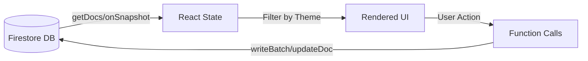

# ตารางตรวจสอบความครบถ้วนของความต้องการ (Requirement Traceability Matrix - RTM)

| รหัสฟีเจอร์ [Feature ID] | ชื่อฟีเจอร์ (Spec Feature Name) | งานที่เกี่ยวข้อง [Tasks] | ไฟล์โค้ดหลัก (Key Code Files) | สถานะ (Status) |
| :--- | :--- | :--- | :--- | :--- |
| **[F-001]** | การยืนยันตัวตน (User Authentication) | [T-003] | `src/lib/firebase.ts`, `Firestore: customers` | **Active** |
| **[F-002]** | การจัดการโปรเจกต์ (Project Management) | [T-010], [T-011], [T-066], [T-015], [T-016] | `src/app/projects/page.tsx`, `src/lib/types.ts` (Project), `src/components/new-project-dialog.tsx` | **Beta** |
| **[F-003]** | การจัดการงาน (Task Management) | [T-013], [T-014], [T-061], [T-063] | `src/app/project/[id]/page.tsx`, `src/components/charts/*`, `src/components/strict-mode-droppable.tsx` | **Beta** |
| **[F-004]** | การติดตามเวลา (Time Tracking) | [T-031], [T-064], [T-065], [T-029] | `src/lib/types.ts`, `src/app/tracking/tracking-client.tsx` | **Beta** |
| **[F-005]** | มุมมองปฏิทิน (Calendar View) | [T-020], [T-021], [T-064], [T-066], [T-029] | `src/app/calendar/page.tsx`, `src/app/calendar/calendar-client-page.tsx`, `src/app/calendar/data-fetcher.ts` | **Active** |
| **[F-006]** | โหมดปาร์ตี้ (Party Mode: Presence & Spyfall)| [T-030] | `src/app/party/*`, `Firestore: spyfall_*` | **Planned** |
| **[F-007]** | ผู้ช่วย AI (AI Assistant) | [T-040] | `src/ai/dev.ts` | **Planned** |
| **[F-008]** | ระบบบริหารความสัมพันธ์ลูกค้า (CRM) & 360 View | [T-025], [T-026], [T-027], [T-029], [T-066], [T-016], [T-070] | `src/app/customers/*` (`page.tsx`, `customer-list-client.tsx`, `customer-detail-client.tsx`), `src/components/add-customer-dialog.tsx`, `src/lib/types.ts` (Customer, Rating) | **Active** |
| **[F-009]** | การปรับปรุงประสิทธิภาพและลดค่าใช้จ่าย (Performance Optimization) | [T-070], [T-071], [T-072], [T-073], [T-074], [T-084] | `src/app/customers/customer-list-client.tsx`, `src/app/tracking/tracking-client.tsx`, `src/lib/firebase.ts`, `src/components/session-timeout.tsx` | **Active** |
| **[F-010]** | ระบบวิเคราะห์ข้อมูล (Analytics Dashboard) | [T-022] | `src/app/analytics/*`, `src/components/charts/filtered-tasks-table.tsx` | **Active** (Features: Sorting, Global Filters (Project/Status/Assignee/Date), Metric Cards, Personalized Columns, Split Columns) |
| **[F-011]** | การจำค่าสถานะ (UI State Persistence) | [T-086] | `src/hooks/use-local-storage.ts`, `src/app/analytics/*`, `src/app/tracking/*` | **Planned** |
| **[F-012]** | การนำขึ้นระบบ (Deployment) | [T-090] | `package.json`, `Cloudflare Pages` | **Planned** |

## โครงข่ายตัวแปรและแหล่งข้อมูล (Data/Variable Traceability)

ส่วนนี้อธิบายความสัมพันธ์ระหว่าง "ข้อมูลหลัก" (Data Entities) และ "ตัวแปรในโค้ด" (Code Variables) เพื่อให้ง่ายต่อการติดตามและแก้ไขในอนาคต

| ข้อมูลหลัก (Entity) | ชื่อ Interface/Type | ตัวแปร State หลัก (Key State Variables) | ไฟล์ที่เกี่ยวข้อง (Related Files) | หมายเหตุ (Notes) |
| :--- | :--- | :--- | :--- | :--- |
| **Project** | `Project` | `allProjects` (Global List), `selectedProject` (Detail/Edit), `projectsCache` (Global Map) | `src/app/projects/projects-client-page.tsx`, `src/app/tracking/tracking-client.tsx`, `src/lib/types.ts`, `src/app/projects/actions.ts` | Field สำคัญ: `isDarkModeOnly` (OS Filtering), **`customerId`** (Link), **`owner`** (Display Name) |
| **Task** | `Task` | `tasks` (List in Project), `allTasksCache` (Global List in Tracking), `tasksWithProjectName` | `src/app/project/[id]/page.tsx`, `src/app/tracking/tracking-client.tsx`, `src/lib/types.ts` | เชื่อมโยงกับ Project ผ่าน `projectId` (**Tracking Update -> Direct Progress Update**) |
| **Customer** | `Customer` | `customers` (List), `customer` (Detail), `osCustomers` (OS Set for Filtering) | `src/app/customers/customer-list-client.tsx`, `src/app/tracking/tracking-client.tsx`, `src/lib/types.ts` | Field สำคัญ: `isDarkModeOnly`, `healthScore`, **`totalProjects`**, **`completedProjects`**, `ratings` (Hybrid Logic) |
| **Tracking Log** | `ProjectTrackingProgress` | `trackingData` (Current View), `trackingCache` (Map<TaskId, Logs[]>), `projectTrackingProgress` (Firestore Collection) | `src/app/tracking/tracking-client.tsx`, `src/lib/types.ts` | บันทึกรายวันแยกตาม `trackerName` (Assignee) และ `date` |
| **Global Cache** | `DataCacheContext` | `customers` (Global Store), `isCustomersLoaded`, `lastUpdated`, `isPollingPaused` | `src/context/data-cache-context.tsx`, `src/app/layout.tsx` | ใช้ Cache ลด Load ซ้ำ + **Auto-Refresh (5 mins)** + **Pause on Idle** |
| **Presence** | `Presence` | `editors` (Map<UserId, Editor>) | `src/components/project-details-client.tsx`, `src/app/calendar/edit-event-dialog.tsx`, `src/lib/anonymous-animals.ts` | ใช้แสดง Avatar คน (Visual Animals) ที่กำลังแก้ไขงาน/Event |
| **Theme** | `n/a` (String) | `theme` (from `useTheme`), `isDarkModeOnly` (Entity Property) | `src/app/tracking/tracking-client.tsx`, `src/app/projects/projects-client-page.tsx` | ใช้ควบคุมการแสดงผล OS Customers/Projects |

### แผนผังการไหลของข้อมูล (Data Flow Diagram - Simplified)

